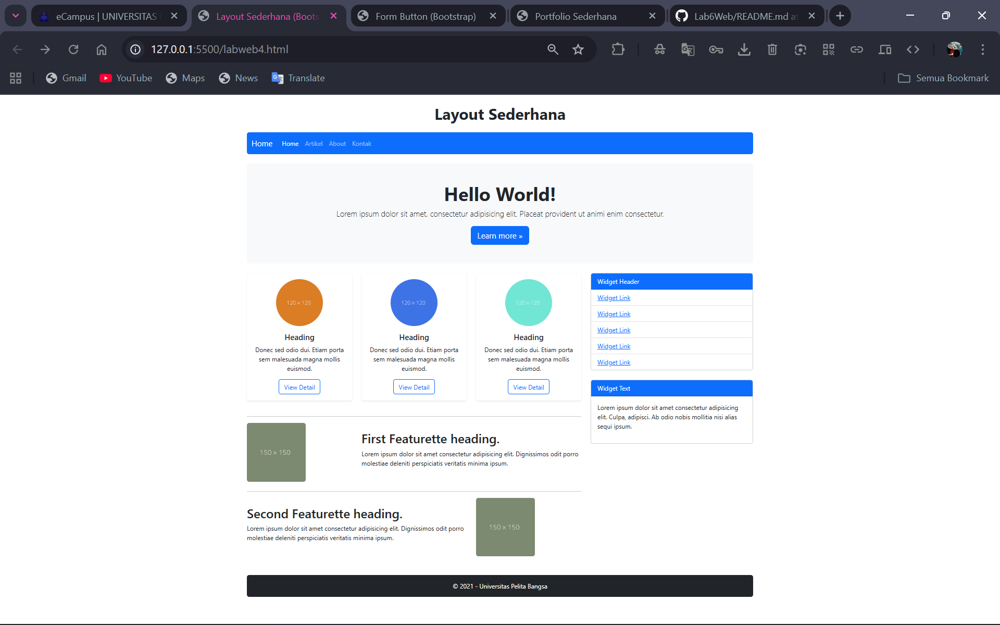
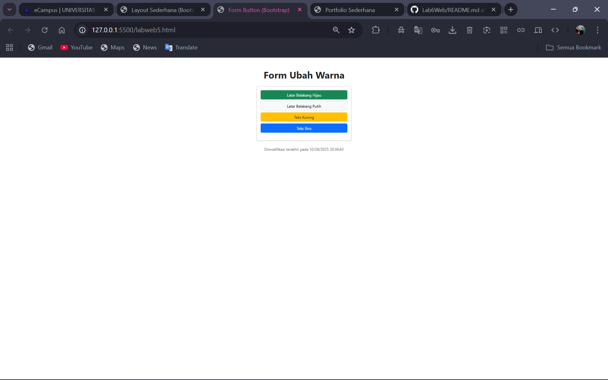
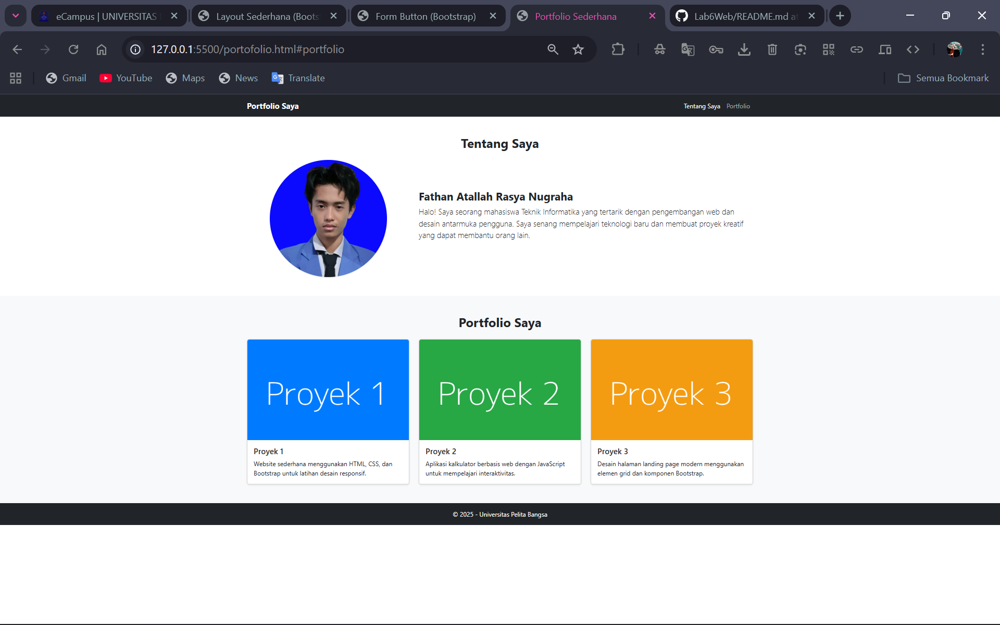

# Lab6Web
```
Nama   : Fathan Atallah Rasya Nugraha
NIM    : 312410425
Kelas  : TI.24.A3
```

## Refactor Praktikum 4
Ambil layout web sederhana dari Praktikum 4. Buat ulang layout tersebut menggunakan
Bootstrap Grid System.
  - Gunakan <nav> Bootstrap untuk bagian navigasi
  - Gunakan class .row dan .col-md-8 untuk main content dan .col-md-4 untuk sidebar
  - Gunakan komponen .card Bootstrap untuk menggantikan .widget-box
  - Gunakan komponen .card untuk menggantikan .box (bagian "Heading" yang berisi 3 kolom)
  - Anda tidak diperbolehkan menggunakan CSS float atau clear manual.<br>

### Code :
```html
  <div class="container my-4">
    <!-- Header -->
    <header class="text-center mb-4">
      <h1 class="fw-bold">Layout Sederhana</h1>
    </header>

    <!-- Navigation -->
    <nav class="navbar navbar-expand-lg navbar-dark bg-primary mb-4 rounded">
      <div class="container-fluid">
        <a class="navbar-brand" href="#">Home</a>
        <button class="navbar-toggler" type="button" data-bs-toggle="collapse" data-bs-target="#navbarNav">
          <span class="navbar-toggler-icon"></span>
        </button>
        <div id="navbarNav" class="collapse navbar-collapse">
          <ul class="navbar-nav me-auto">
            <li class="nav-item"><a href="lab4_layout.html" class="nav-link active">Home</a></li>
            <li class="nav-item"><a href="artikel.html" class="nav-link">Artikel</a></li>
            <li class="nav-item"><a href="about.html" class="nav-link">About</a></li>
            <li class="nav-item"><a href="kontak.html" class="nav-link">Kontak</a></li>
          </ul>
        </div>
      </div>
    </nav>

    <!-- Hero Section -->
    <section class="p-5 mb-4 bg-light rounded-3 text-center">
      <h1 class="display-5 fw-bold">Hello World!</h1>
      <p class="lead">Lorem ipsum dolor sit amet, consectetur adipisicing elit. Placeat provident ut animi enim consectetur.</p>
      <a href="home.html" class="btn btn-primary btn-lg">Learn more &raquo;</a>
    </section>

    <!-- Main Content -->
    <div class="row">
      <main class="col-md-8">
        <!-- 3 Box -->
        <div class="row text-center mb-4">
          <div class="col-md-4 mb-3">
            <div class="card border-0 shadow-sm h-100">
              
              <div class="card-body">
                <h5 class="card-title">Heading</h5>
                <p class="card-text">Donec sed odio dui. Etiam porta sem malesuada magna mollis euismod.</p>
                <a href="#" class="btn btn-outline-primary">View Detail</a>
              </div>
            </div>
          </div>
          <div class="col-md-4 mb-3">
            <div class="card border-0 shadow-sm h-100">
              
              <div class="card-body">
                <h5 class="card-title">Heading</h5>
                <p class="card-text">Donec sed odio dui. Etiam porta sem malesuada magna mollis euismod.</p>
                <a href="#" class="btn btn-outline-primary">View Detail</a>
              </div>
            </div>
          </div>
          <div class="col-md-4 mb-3">
            <div class="card border-0 shadow-sm h-100">
              
              <div class="card-body">
                <h5 class="card-title">Heading</h5>
                <p class="card-text">Donec sed odio dui. Etiam porta sem malesuada magna mollis euismod.</p>
                <a href="#" class="btn btn-outline-primary">View Detail</a>
              </div>
            </div>
          </div>
        </div>

        <hr>

        <!-- Artikel 1 -->
        <article class="mb-4">
          <div class="row align-items-center">
            <div class="col-md-4">
              
            </div>
            <div class="col-md-8">
              <h2>First Featurette heading.</h2>
              <p>Lorem ipsum dolor sit amet consectetur adipisicing elit. Dignissimos odit porro molestiae deleniti perspiciatis veritatis minima ipsum.</p>
            </div>
          </div>
        </article>

        <hr>

        <!-- Artikel 2 -->
        <article class="mb-4">
          <div class="row align-items-center">
            <div class="col-md-8">
              <h2>Second Featurette heading.</h2>
              <p>Lorem ipsum dolor sit amet consectetur adipisicing elit. Dignissimos odit porro molestiae deleniti perspiciatis veritatis minima ipsum.</p>
            </div>
            <div class="col-md-4">
              
            </div>
          </div>
        </article>
      </main>

      <!-- Sidebar -->
      <aside class="col-md-4">
        <div class="card mb-4">
          <div class="card-header bg-primary text-white">Widget Header</div>
          <ul class="list-group list-group-flush">
            <li class="list-group-item"><a href="#">Widget Link</a></li>
            <li class="list-group-item"><a href="#">Widget Link</a></li>
            <li class="list-group-item"><a href="#">Widget Link</a></li>
            <li class="list-group-item"><a href="#">Widget Link</a></li>
            <li class="list-group-item"><a href="#">Widget Link</a></li>
          </ul>
        </div>

        <div class="card">
          <div class="card-header bg-primary text-white">Widget Text</div>
          <div class="card-body">
            <p>Lorem ipsum dolor sit amet consectetur adipisicing elit. Culpa, adipisci. Ab odio nobis mollitia nisi alias sequi ipsum.</p>
          </div>
        </div>
      </aside>
    </div>

    <!-- Footer -->
    <footer class="bg-dark text-white text-center py-3 mt-4 rounded">
      <p class="mb-0">&copy; 2021 - Universitas Pelita Bangsa</p>
    </footer>
  </div>
```


## Refactor Praktikum 5
Ambil salah satu form dari Praktikum 5 (misalnya Form Input 23atau Form Button 24).
Buat ulang form tersebut agar terlihat rapi menggunakan class-class form Bootstrap (.form-control, .form-label, .btn).

Form Button<br>

### Code:
```html
<body class="text-center py-5">

  <div class="container">
    <h1 class="mb-4 fw-bold">Form Ubah Warna</h1>

    <div class="card shadow-sm mx-auto" style="max-width: 400px;">
      <div class="card-body">
        <form>
          <div class="d-grid gap-2 mb-3">
            <button type="button" class="btn btn-success" onclick="ubahWarnaLB('green')">Latar Belakang Hijau</button>
            <button type="button" class="btn btn-light border" onclick="ubahWarnaLB('white')">Latar Belakang Putih</button>
            <button type="button" class="btn btn-warning text-dark" onclick="ubahWarnaLD('yellow')">Teks Kuning</button>
            <button type="button" class="btn btn-primary" onclick="ubahWarnaLD('blue')">Teks Biru</button>
          </div>
        </form>
      </div>
    </div>

    <p class="mt-4 text-muted" id="modified"></p>
  </div>

  <script>
    function ubahWarnaLB(warna) {
      document.body.style.backgroundColor = warna;
    }

    function ubahWarnaLD(warna) {
      document.body.style.color = warna;
    }

    document.getElementById("modified").innerText =
      "Dimodifikasi terakhir pada " + document.lastModified;
  </script>
```

## Buat Halaman Portfolio Sederhana
Buat satu halaman HTML baru (portfolio.html) menggunakan Bootstrap yang berisi:
  1. Sebuah Navbar di bagian atas.
  2. Sebuah section "Tentang Saya" di dalam .container dengan 1 baris (.row) dan 2 kolom (.col):<br>
    - Kolom kiri (.col-md-4) berisi foto Anda (gunakan  dengan class .img-fluid).<br>
    - Kolom kanan (.col-md-8) berisi nama dan deskripsi diri Anda.
  3. Sebuah section "Portfolio Saya" di dalam .container dengan 1 baris (.row) dan 3 kolom (.col-md-4):<br>
    - Setiap kolom berisi satu komponen .card yang merepresentasikan satu proyek (beri gambar dummy dan deskripsi singkat).


### Code:
```html
<!-- Navbar -->
  <nav class="navbar navbar-expand-lg navbar-dark bg-dark">
    <div class="container">
      <a class="navbar-brand fw-bold" href="#">Portfolio Saya</a>
      <button class="navbar-toggler" type="button" data-bs-toggle="collapse" data-bs-target="#navbarNav">
        <span class="navbar-toggler-icon"></span>
      </button>
      <div id="navbarNav" class="collapse navbar-collapse">
        <ul class="navbar-nav ms-auto">
          <li class="nav-item"><a href="#tentang" class="nav-link active">Tentang Saya</a></li>
          <li class="nav-item"><a href="#portfolio" class="nav-link">Portfolio</a></li>
        </ul>
      </div>
    </div>
  </nav>

  <!-- Tentang Saya -->
  <section id="tentang" class="py-5">
    <div class="container">
      <h2 class="text-center mb-4 fw-bold">Tentang Saya</h2>
      <div class="row align-items-center">
        <!-- Kolom kiri: Foto -->
        <div class="col-md-4 text-center mb-3 mb-md-0">
          
        </div>
        <!-- Kolom kanan: Deskripsi -->
        <div class="col-md-8">
          <h3 class="fw-bold">Fathan Atallah Rasya Nugraha</h3>
          <p class="lead">
            Halo! Saya seorang mahasiswa Teknik Informatika yang tertarik dengan pengembangan web dan desain antarmuka pengguna.
            Saya senang mempelajari teknologi baru dan membuat proyek kreatif yang dapat membantu orang lain.
          </p>
        </div>
      </div>
    </div>
  </section>

  <!-- Portfolio Saya -->
  <section id="portfolio" class="py-5 bg-light">
    <div class="container">
      <h2 class="text-center mb-4 fw-bold">Portfolio Saya</h2>
      <div class="row g-4">
        <!-- Card 1 -->
        <div class="col-md-4">
          <div class="card h-100 shadow-sm">
            
            <div class="card-body">
              <h5 class="card-title">Proyek 1</h5>
              <p class="card-text">Website sederhana menggunakan HTML, CSS, dan Bootstrap untuk latihan desain responsif.</p>
            </div>
          </div>
        </div>
        <!-- Card 2 -->
        <div class="col-md-4">
          <div class="card h-100 shadow-sm">
            
            <div class="card-body">
              <h5 class="card-title">Proyek 2</h5>
              <p class="card-text">Aplikasi kalkulator berbasis web dengan JavaScript untuk mempelajari interaktivitas.</p>
            </div>
          </div>
        </div>
        <!-- Card 3 -->
        <div class="col-md-4">
          <div class="card h-100 shadow-sm">
            
            <div class="card-body">
              <h5 class="card-title">Proyek 3</h5>
              <p class="card-text">Desain halaman landing page modern menggunakan elemen grid dan komponen Bootstrap.</p>
            </div>
          </div>
        </div>
      </div>
    </div>
  </section>

  <!-- Footer -->
  <footer class="bg-dark text-white text-center py-3">
    <p class="mb-0">&copy; 2025 - Universitas Pelita Bangsa</p>
  </footer>
```
